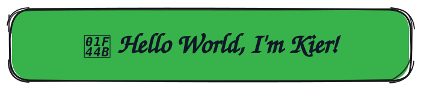

  

  
  
  

---

## 🚀 Featured Project

<table>
  <tr>
    <td>
      

        <h3><a href="https://github.com/xKier2/Sabay">Sabay: AI-Powered Work Management Platform</a></h3>
        
<em>Simplify board and task orchestration, supercharged with autonomous multi-agent task extraction.</em>

      

  **Key Highlights & Agent Mode:**
  * **Boards & Work Management:** Organize tasks, sprints, and team workflows on interactive boards.
  * **Autonomous Agent Mode:** Upload raw text PDFs (meeting notes, PRDs, project briefs) to trigger a team of AI agents that automatically parses deliverables, assigns owners, estimates timelines, and sets due dates.
  * **Intelligent Deduplication:** Prevents duplicate task creation using similarity matching via vector embeddings (`fastembed`) and fuzzy string matching (`RapidFuzz`).

  ---

  #### 🛠️ Architectural Stack

  * **AI Ecosystem & Providers:**       
  * **Backend & API:**    
  * **Database & Vector Search:**     
  * **Duplicate Search:**  
  * **Document Parsing & Services:**  
  * **Frontend:**    
  * **Testing Suite:**  

  

    <a href="https://github.com/xKier2/Sabay"><strong>View Sabay Repository & Documentation &rarr;</strong></a>
  

    </td>
  </tr>
</table>

---

## 🛠️ Technical Stack

  <h3>Languages & Frameworks</h3>
  

    
  

  <h3>Databases</h3>
  

    
  

  
  <h3>Cloud & DevOps</h3>
  

    
  

---

## 🏆 Hackathons & Competitions

| Event | Organizer / Host | Key Focus |
| :--- | :--- | :--- |
| **Inside the Game: Developer Hackathon** | **Microsoft Innovation Studio** | Cloud Innovation & Rapid Prototyping |
| **AppBuildersPH Hackathon** | **AppBuildersPH & Cerebral Valley** | AI-First Applications & Product Development |

---

## 📊 GitHub Activity

  

  
   

  

---

## Open Source & Collaboration

> [!NOTE]
> You're welcome to explore my public repositories, report reproducible issues, suggest improvements, and submit contributions to projects that accept them. Contribution rules and project scope may vary by repository, so check each project's README, issue tracker, and contribution guidance first.

---

  <strong>Thanks for stopping by.</strong>
   
  Feel free to explore, connect, and collaborate.

  © 2026 Kier Gabriel Tongol

